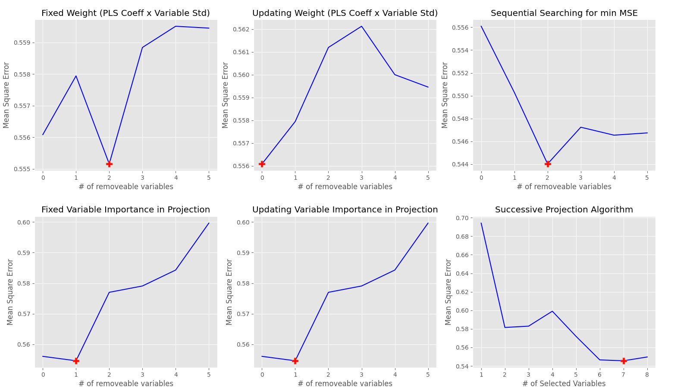
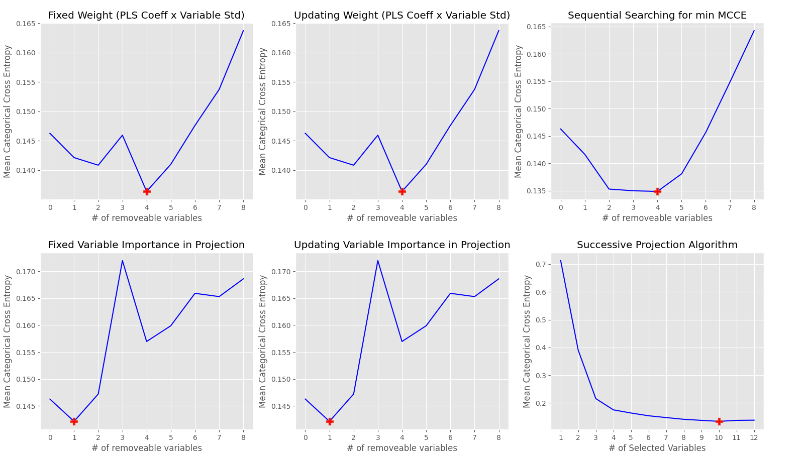

# variable_selection
Variable selection for NIR spectral analysis(regression and classification) based on WRC, VIP, SFS, and SPA

# WRC(Weighted Regression Coefficient)
Based on PLS coefficient for variables and standard deviation of variables, the score of variables is constructed for finding the indices of removeable variables.

# VIP(Variable Importance in Projection)
Based on VIP score, the indices of removeable variables are found.

# SFS(Sequential Feature Selection)
Through sequential calculation of loss error during one-by-one removal for every variables, the indices of removeal variables are found for revealing min loss error.  

# SPA(Successive Projections Algorithm)
For chained variables from QR projection process, the best variables set is found, and then some of removeable variables are found based on WRC.

# Usage
## Regression
```bash
$ python3 variable_selection_regression.py
samle.feature_names
 ['age', 'sex', 'bmi', 'bp', 's1', 's2', 's3', 's4', 's5', 's6']
sample.data
 (442, 10)
sample.target
 (442,)

(python:143670): Gtk-WARNING **: 00:13:55.367: Theme parsing error: gtk.css:5597:11: Not using units is deprecated. Assuming 'px'.

(python:143670): Gtk-WARNING **: 00:13:55.367: Theme parsing error: gtk.css:5597:14: '0' is not a valid color name

(python:143670): Gtk-WARNING **: 00:13:55.367: Theme parsing error: gtk.css:5831:14: '202020' is not a valid color name

(python:143670): Gtk-WARNING **: 00:13:55.367: Theme parsing error: gtk.css:5846:20: Junk at end of value for border-width

(python:143670): Gtk-WARNING **: 00:13:55.367: Theme parsing error: gtk.css:5871:20: Junk at end of value for border-width

(python:143670): Gtk-WARNING **: 00:13:55.367: Theme parsing error: gtk.css:5898:20: Junk at end of value for border-width
### getRemovalIndicesByFixedScoreXStd ###
Removeable Variable's Indices:
 [9 0 6 4 5]
Optimal Variable's Indices:
 {1, 2, 3, 7, 8}
### getRemovalIndicesByUpdatingScoreXStd ###
Removeable Variable's Indices:
 []
Optimal Variable's Indices:
 {0, 1, 2, 3, 4, 5, 6, 7, 8, 9}
### getRemovalIndicesByFixedVariableImportanceInProjection ###
Removeable Variable's Indices:
 [0 1 4 5]
Optimal Variable's Indices:
 {2, 3, 6, 7, 8, 9}
### getRemovalIndicesByUpdatingVariableImportanceInProjection ###
Removeable Variable's Indices:
 [0 1 4 5]
Optimal Variable's Indices:
 {2, 3, 6, 7, 8, 9}
### getRemovalIndicesBySequentialSearch ###
Removeable Variable's Indices:
 [7 6 0]
Optimal Variable's Indices:
 {1, 2, 3, 4, 5, 8, 9}
### getIndicesBySuccessiveProjectionAlgorithm ###
Optimal Variable's Indices:
 [2 8 3 6 4 1 9]
Removeable Variable's Indices:
 {0, 5, 7}
```



## Classification
```bash
$ python3 variable_selection_classification.py
sample.feature_names
 ['alcohol', 'malic_acid', 'ash', 'alcalinity_of_ash', 'magnesium', 'total_phenols', 'flavanoids', 'nonflavanoid_phenols', 'proanthocyanins', 'color_intensity', 'hue', 'od280/od315_of_diluted_wines', 'proline']
sample.data
 [[1.423e+01 1.710e+00 2.430e+00 ... 1.040e+00 3.920e+00 1.065e+03]
 [1.320e+01 1.780e+00 2.140e+00 ... 1.050e+00 3.400e+00 1.050e+03]
 [1.316e+01 2.360e+00 2.670e+00 ... 1.030e+00 3.170e+00 1.185e+03]
 ...
 [1.327e+01 4.280e+00 2.260e+00 ... 5.900e-01 1.560e+00 8.350e+02]
 [1.317e+01 2.590e+00 2.370e+00 ... 6.000e-01 1.620e+00 8.400e+02]
 [1.413e+01 4.100e+00 2.740e+00 ... 6.100e-01 1.600e+00 5.600e+02]]
sample.target
 [0 0 0 0 0 0 0 0 0 0 0 0 0 0 0 0 0 0 0 0 0 0 0 0 0 0 0 0 0 0 0 0 0 0 0 0 0
 0 0 0 0 0 0 0 0 0 0 0 0 0 0 0 0 0 0 0 0 0 0 1 1 1 1 1 1 1 1 1 1 1 1 1 1 1
 1 1 1 1 1 1 1 1 1 1 1 1 1 1 1 1 1 1 1 1 1 1 1 1 1 1 1 1 1 1 1 1 1 1 1 1 1
 1 1 1 1 1 1 1 1 1 1 1 1 1 1 1 1 1 1 1 2 2 2 2 2 2 2 2 2 2 2 2 2 2 2 2 2 2
 2 2 2 2 2 2 2 2 2 2 2 2 2 2 2 2 2 2 2 2 2 2 2 2 2 2 2 2 2 2]
one-hot style
 [[1 0 0]
 [1 0 0]
 [1 0 0]
 [1 0 0]
 [1 0 0]
 [1 0 0]
 [1 0 0]
 [1 0 0]
 [1 0 0]
 [1 0 0]
 [1 0 0]
 [1 0 0]
 [1 0 0]
 [1 0 0]
 [1 0 0]
 [1 0 0]
 [1 0 0]
 [1 0 0]
 [1 0 0]
 [1 0 0]
 [1 0 0]
 [1 0 0]
 [1 0 0]
 [1 0 0]
 [1 0 0]
 [1 0 0]
 [1 0 0]
 [1 0 0]
 [1 0 0]
 [1 0 0]
 [1 0 0]
 [1 0 0]
 [1 0 0]
 [1 0 0]
 [1 0 0]
 [1 0 0]
 [1 0 0]
 [1 0 0]
 [1 0 0]
 [1 0 0]
 [1 0 0]
 [1 0 0]
 [1 0 0]
 [1 0 0]
 [1 0 0]
 [1 0 0]
 [1 0 0]
 [1 0 0]
 [1 0 0]
 [1 0 0]
 [1 0 0]
 [1 0 0]
 [1 0 0]
 [1 0 0]
 [1 0 0]
 [1 0 0]
 [1 0 0]
 [1 0 0]
 [1 0 0]
 [0 1 0]
 [0 1 0]
 [0 1 0]
 [0 1 0]
 [0 1 0]
 [0 1 0]
 [0 1 0]
 [0 1 0]
 [0 1 0]
 [0 1 0]
 [0 1 0]
 [0 1 0]
 [0 1 0]
 [0 1 0]
 [0 1 0]
 [0 1 0]
 [0 1 0]
 [0 1 0]
 [0 1 0]
 [0 1 0]
 [0 1 0]
 [0 1 0]
 [0 1 0]
 [0 1 0]
 [0 1 0]
 [0 1 0]
 [0 1 0]
 [0 1 0]
 [0 1 0]
 [0 1 0]
 [0 1 0]
 [0 1 0]
 [0 1 0]
 [0 1 0]
 [0 1 0]
 [0 1 0]
 [0 1 0]
 [0 1 0]
 [0 1 0]
 [0 1 0]
 [0 1 0]
 [0 1 0]
 [0 1 0]
 [0 1 0]
 [0 1 0]
 [0 1 0]
 [0 1 0]
 [0 1 0]
 [0 1 0]
 [0 1 0]
 [0 1 0]
 [0 1 0]
 [0 1 0]
 [0 1 0]
 [0 1 0]
 [0 1 0]
 [0 1 0]
 [0 1 0]
 [0 1 0]
 [0 1 0]
 [0 1 0]
 [0 1 0]
 [0 1 0]
 [0 1 0]
 [0 1 0]
 [0 1 0]
 [0 1 0]
 [0 1 0]
 [0 1 0]
 [0 1 0]
 [0 1 0]
 [0 0 1]
 [0 0 1]
 [0 0 1]
 [0 0 1]
 [0 0 1]
 [0 0 1]
 [0 0 1]
 [0 0 1]
 [0 0 1]
 [0 0 1]
 [0 0 1]
 [0 0 1]
 [0 0 1]
 [0 0 1]
 [0 0 1]
 [0 0 1]
 [0 0 1]
 [0 0 1]
 [0 0 1]
 [0 0 1]
 [0 0 1]
 [0 0 1]
 [0 0 1]
 [0 0 1]
 [0 0 1]
 [0 0 1]
 [0 0 1]
 [0 0 1]
 [0 0 1]
 [0 0 1]
 [0 0 1]
 [0 0 1]
 [0 0 1]
 [0 0 1]
 [0 0 1]
 [0 0 1]
 [0 0 1]
 [0 0 1]
 [0 0 1]
 [0 0 1]
 [0 0 1]
 [0 0 1]
 [0 0 1]
 [0 0 1]
 [0 0 1]
 [0 0 1]
 [0 0 1]
 [0 0 1]]
X:
 [[ 1.51861254 -0.5622498   0.23205254 ...  0.36217728  1.84791957
   1.01300893]
 [ 0.24628963 -0.49941338 -0.82799632 ...  0.40605066  1.1134493
   0.96524152]
 [ 0.19687903  0.02123125  1.10933436 ...  0.31830389  0.78858745
   1.39514818]
 ...
 [ 0.33275817  1.74474449 -0.38935541 ... -1.61212515 -1.48544548
   0.28057537]
 [ 0.20923168  0.22769377  0.01273209 ... -1.56825176 -1.40069891
   0.29649784]
 [ 1.39508604  1.58316512  1.36520822 ... -1.52437837 -1.42894777
  -0.59516041]]
Y:
 [[1 0 0]
 [1 0 0]
 [1 0 0]
 [1 0 0]
 [1 0 0]
 [1 0 0]
 [1 0 0]
 [1 0 0]
 [1 0 0]
 [1 0 0]
 [1 0 0]
 [1 0 0]
 [1 0 0]
 [1 0 0]
 [1 0 0]
 [1 0 0]
 [1 0 0]
 [1 0 0]
 [1 0 0]
 [1 0 0]
 [1 0 0]
 [1 0 0]
 [1 0 0]
 [1 0 0]
 [1 0 0]
 [1 0 0]
 [1 0 0]
 [1 0 0]
 [1 0 0]
 [1 0 0]
 [1 0 0]
 [1 0 0]
 [1 0 0]
 [1 0 0]
 [1 0 0]
 [1 0 0]
 [1 0 0]
 [1 0 0]
 [1 0 0]
 [1 0 0]
 [1 0 0]
 [1 0 0]
 [1 0 0]
 [1 0 0]
 [1 0 0]
 [1 0 0]
 [1 0 0]
 [1 0 0]
 [1 0 0]
 [1 0 0]
 [1 0 0]
 [1 0 0]
 [1 0 0]
 [1 0 0]
 [1 0 0]
 [1 0 0]
 [1 0 0]
 [1 0 0]
 [1 0 0]
 [0 1 0]
 [0 1 0]
 [0 1 0]
 [0 1 0]
 [0 1 0]
 [0 1 0]
 [0 1 0]
 [0 1 0]
 [0 1 0]
 [0 1 0]
 [0 1 0]
 [0 1 0]
 [0 1 0]
 [0 1 0]
 [0 1 0]
 [0 1 0]
 [0 1 0]
 [0 1 0]
 [0 1 0]
 [0 1 0]
 [0 1 0]
 [0 1 0]
 [0 1 0]
 [0 1 0]
 [0 1 0]
 [0 1 0]
 [0 1 0]
 [0 1 0]
 [0 1 0]
 [0 1 0]
 [0 1 0]
 [0 1 0]
 [0 1 0]
 [0 1 0]
 [0 1 0]
 [0 1 0]
 [0 1 0]
 [0 1 0]
 [0 1 0]
 [0 1 0]
 [0 1 0]
 [0 1 0]
 [0 1 0]
 [0 1 0]
 [0 1 0]
 [0 1 0]
 [0 1 0]
 [0 1 0]
 [0 1 0]
 [0 1 0]
 [0 1 0]
 [0 1 0]
 [0 1 0]
 [0 1 0]
 [0 1 0]
 [0 1 0]
 [0 1 0]
 [0 1 0]
 [0 1 0]
 [0 1 0]
 [0 1 0]
 [0 1 0]
 [0 1 0]
 [0 1 0]
 [0 1 0]
 [0 1 0]
 [0 1 0]
 [0 1 0]
 [0 1 0]
 [0 1 0]
 [0 1 0]
 [0 0 1]
 [0 0 1]
 [0 0 1]
 [0 0 1]
 [0 0 1]
 [0 0 1]
 [0 0 1]
 [0 0 1]
 [0 0 1]
 [0 0 1]
 [0 0 1]
 [0 0 1]
 [0 0 1]
 [0 0 1]
 [0 0 1]
 [0 0 1]
 [0 0 1]
 [0 0 1]
 [0 0 1]
 [0 0 1]
 [0 0 1]
 [0 0 1]
 [0 0 1]
 [0 0 1]
 [0 0 1]
 [0 0 1]
 [0 0 1]
 [0 0 1]
 [0 0 1]
 [0 0 1]
 [0 0 1]
 [0 0 1]
 [0 0 1]
 [0 0 1]
 [0 0 1]
 [0 0 1]
 [0 0 1]
 [0 0 1]
 [0 0 1]
 [0 0 1]
 [0 0 1]
 [0 0 1]
 [0 0 1]
 [0 0 1]
 [0 0 1]
 [0 0 1]
 [0 0 1]
 [0 0 1]]

(python:144166): Gtk-WARNING **: 00:17:07.889: Theme parsing error: gtk.css:5597:11: Not using units is deprecated. Assuming 'px'.

(python:144166): Gtk-WARNING **: 00:17:07.889: Theme parsing error: gtk.css:5597:14: '0' is not a valid color name

(python:144166): Gtk-WARNING **: 00:17:07.889: Theme parsing error: gtk.css:5831:14: '202020' is not a valid color name

(python:144166): Gtk-WARNING **: 00:17:07.889: Theme parsing error: gtk.css:5846:20: Junk at end of value for border-width

(python:144166): Gtk-WARNING **: 00:17:07.889: Theme parsing error: gtk.css:5871:20: Junk at end of value for border-width

(python:144166): Gtk-WARNING **: 00:17:07.889: Theme parsing error: gtk.css:5898:20: Junk at end of value for border-width
### getRemovalIndicesByFixedScoreXStd ###
Removeable Variable's Indices:
 [4 5 7 8]
Optimal Variable's Indices:
 {0, 1, 2, 3, 6, 9, 10, 11, 12}
### getRemovalIndicesByUpdatingScoreXStd ###
Removeable Variable's Indices:
 [4 5 7 8]
Optimal Variable's Indices:
 {0, 1, 2, 3, 6, 9, 10, 11, 12}
### getRemovalIndicesByFixedVariableImportanceInProjection ###
Removeable Variable's Indices:
 [4]
Optimal Variable's Indices:
 {0, 1, 2, 3, 5, 6, 7, 8, 9, 10, 11, 12}
### getRemovalIndicesByUpdatingVariableImportanceInProjection ###
Removeable Variable's Indices:
 [4]
Optimal Variable's Indices:
 {0, 1, 2, 3, 5, 6, 7, 8, 9, 10, 11, 12}
### getRemovalIndicesBySequentialSearch ###
Removeable Variable's Indices:
 [ 8 10  5  4]
Optimal Variable's Indices:
 {0, 1, 2, 3, 6, 7, 9, 11, 12}
### getIndicesBySuccessiveProjectionAlgorithm ###
Optimal Variable's Indices:
 [ 6 12  9  0  2  3 11 10  1  7]
Removeable Variable's Indices:
 {8, 4, 5}
```
